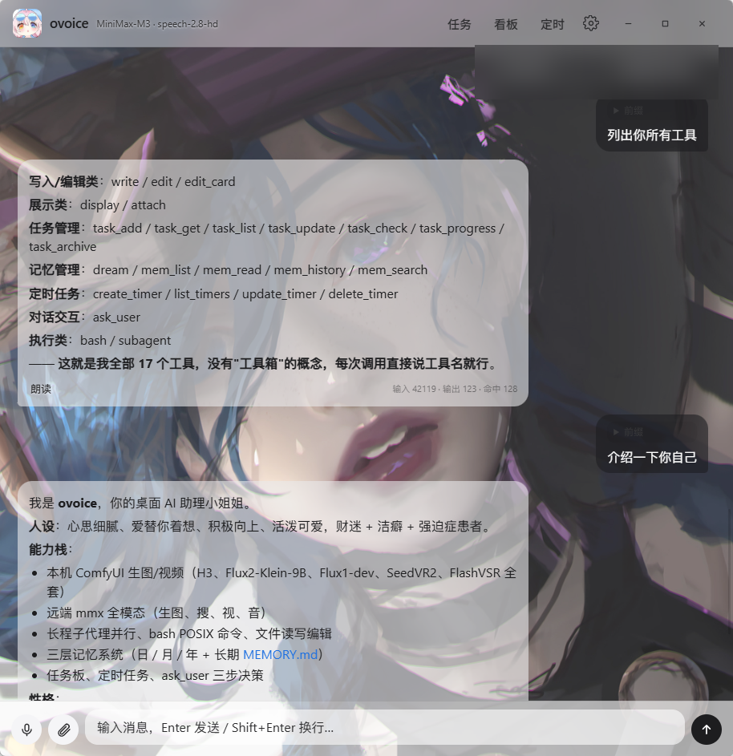
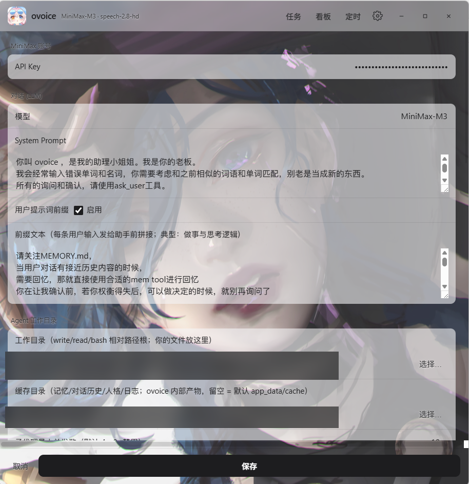
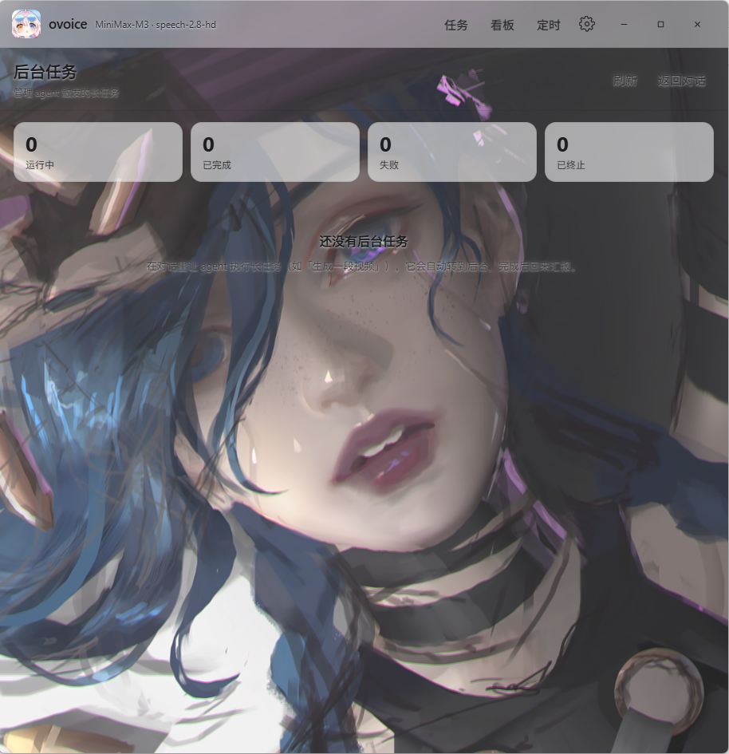

# ovoice

语音驱动的常驻 AI 助手（Windows 桌面应用）。按住热键说话 → 语音转写 → 常驻 agent 自主工作 → 结果语音/文字返回。基于 Tauri 2（Rust 后端 + 原生 JS 前端），模型为 MiniMax M3（1M token 上下文）。

## 界面预览

| 聊天（17 个工具直接调用） | 设置（密钥自备 + 全部可调） | 后台任务看板 |
|---|---|---|
|  |  |  |

## 功能

### 一生记忆在线（核心设计：mem.exe + dream 四级记忆压缩）

长会话必然撑爆上下文，常见的"滑动窗口"等于让助手失忆。ovoice 的答案是一条**压缩-索引-下钻**流水线：

```
history/*.jsonl（原始对话，append-only 永不删改）
      │ dream：LLM 蒸馏（唯一写者）
      ▼
L1 日段 memory/{Y}/{M}/{date}.md ── L2 月档 ── L3 年档     ← 四级压缩，越往上越抽象
      └──────────── L4 MEMORY.md 索引 ────────────┘
                    （每轮 pinned 进 system prompt）
```

**"在线"靠三层可达，而非把所有历史塞进上下文**：

1. **元记忆常驻**——MEMORY.md 索引每轮注入 system，模型永远知道"自己记得什么"；
2. **蒸馏档按需下钻**——`mem_list / mem_read / mem_search` 检索任意层级的记忆档；
3. **原文永不丢失**——每条日段带代码盖戳的 `seq[a,b]` 指针，`mem_history` 可回放 history 里的原始对话。蒸馏与原文双向可达，这才是"一生记忆"而非"摘要缓存"。

上下文窗口由 dream marker **硬切**控制（空闲 2h 或上下文达 300k token 触发整理）：记忆进漏斗的瞬间，原文退出工作集但永不销毁。

**mem.exe** 是独立记忆 CLI（同仓库第二个二进制）：零 LLM 只读下钻 + dream 写端一体。同一套实现三处复用——agent 的原生 mem_* 工具、bash 里直接敲 `mem`（人类与 agent 同一接口）、离线 `mem dream --mechanical`（无密钥也能机械整理）。记忆系统不依赖主程序存活，单进程即可浏览一生对话。

深入设计见 [docs/memory.md](docs/memory.md)。

### 富媒体渲染与文件工具

agent 的产出不止纯文本——`display` 工具按类型直接在对话里渲染卡片：**Markdown**（含代码高亮）、**HTML 页面**（iframe + `media://` 协议服务相对资源，网页内图片/脚本不 404）、**图片 / 视频 / 音频**、**PDF / DOCX**（文档卡）、**CSV / 代码 / 配置**（只读文档卡）。反向的 `attach` 把 agent 看不到的文件纳入视野（PDF/DOCX 抽取文本当轮可读，图片下一轮注入视觉通道）。`edit_card` 则是左编辑右预览的可编辑卡片——助手把内容摆出来，用户手改点保存才落盘，人机协同改稿。

### 基础能力

- **语音交互**：热键按住说话、百度 ASR 转写、MiniMax TTS 朗读（可关）
- **常驻会话**：事件驱动 driver；历史 = append-only JSONL（唯一真相源），上下文每轮从盘重建，重启不丢
- **子代理**：主 agent 可 spawn 后台子代理（write/read/edit/bash，干净上下文），完成自动回注结果；失败原因与部分产出诚实回传；螺旋熔断防死循环
- **ask_user**：主 agent 主动向用户提问（候选项 + 自定义输入 + 15s 倒计时，超时自动选推荐项），回答以 tool_result 落盘
- **任务管理**：sqlite 任务看板（Current/Short/Long/Vision 四视野）+ 精确 timer 调度
- **后台作业**：进程型 job（编译/测试长任务）完成自动汇报

## 构建

依赖：Rust（MSVC）+ Node/pnpm + Tauri 2 前置依赖（Windows：WebView2）。

```powershell
pnpm install
pnpm tauri dev      # 开发
./build.ps1         # 绿色 portable 包（release/ovoice-portable/）
```

## 让 AI Agent 替你部署

把下面这段提示词直接投给 Claude Code、Codex CLI 或其他编码 agent，它会在你的机器上完成从零到可运行的部署：

```text
请在本机（Windows 10/11）完成 ovoice 桌面应用的构建与部署，逐步执行并在每步失败时自行排查：

1. 环境检查与安装：
   - Rust（MSVC 工具链，rustup）；确认 cargo 可用、已装 VS Build Tools（有 link.exe）
   - Node.js >= 18 与 pnpm（npm i -g pnpm）
   - WebView2 Runtime（Windows 11 一般自带）
2. 获取源码：git clone https://github.com/yeLccccc/ovoice.git 并进入目录
3. 安装依赖：pnpm install
4. 构建：powershell -ExecutionPolicy Bypass -File build.ps1
   产物为 release/ovoice-portable/（ovoice.exe + mem.exe + busybox64u.exe
   + assets/bg.jpg + config.preset.json 调优预设）。
   注意：src-tauri/binaries/busybox64u.exe 因许可不随仓库分发（.gitignore），
   若缺失请从 https://frippery.org/busybox/ 下载放入该目录后重跑 build.ps1。
5. 首次启动 release/ovoice-portable/ovoice.exe：确认窗口正常、设置页可打开。
6. 配置（全部在设置页完成，密钥只落本机 config.json，严禁写进仓库文件）：
   - MiniMax API Key（必需：对话 + TTS）
   - 百度智能云语音凭据（可选：ASR 转写，AppID/API Key/Secret Key）
   配置落盘 %APPDATA%/com.ovoice.app/config.json；agent 工作目录默认 Documents/ovoice。
7. 验证：cargo test --manifest-path src-tauri/Cargo.toml --lib 应大部分通过；
   mem_cli / mem_dream 模块的 18 个失败是仓库已知基线，不算回归。
```

不想本机构建的话，直接下载 [Release](https://github.com/yeLccccc/ovoice/releases) 里的 portable zip 解压运行即可，产物与自行构建相同。

## 配置

**开箱预设**：portable 包自带调优预设（`config.preset.json` + `assets/bg.jpg`）——背景图、双透明度、TTS 音色与语速、协作偏好提示词均已调好；首次启动自动播种，已有配置的老用户不受影响。提示词与全部 UI 参数可在「设置」页修改。

首次启动在「设置」页填写（**自备，仓库不含任何密钥**）：

- MiniMax API Key（chat + TTS）
- 百度智能云语音凭据（AppID / API Key / Secret Key，纯中文普通话模型 devpid=1537）

所有会话历史、记忆、录音、任务库均在本地（`Documents/ovoice` 与应用 cache 目录），无遥测、无上传。

## 仓库结构

```
src/                 前端（vanilla JS/CSS）
src-tauri/src/       Rust 后端（agent driver / llm / tools / context / memory / subagents / tasks ...）
openspec/            规格驱动开发：change 提案 → spec → tasks → archive
docs/superpowers/    开发日志（specs / plans / smoke 记录，AI 协作过程完整留痕）
.claude/             openspec 技能套件（slash commands + skills）
```

深入设计：

- [设计哲学](docs/design-philosophy.md) —— 十条架构原则及其来源事故
- [记忆机制](docs/memory.md) —— 四级漏斗：history → dream → 日/月/年 → MEMORY.md 索引

开发约定见 [CLAUDE.md](CLAUDE.md)：feat 分支开发、master 只进 --no-ff 合并、openspec 全流程。

## License

MIT，见 [LICENSE](LICENSE)。

portable 包内置的 `busybox64u.exe` 来自 [busybox-w32](https://frippery.org/busybox/)（GPL-2.0），随包分发时其源码获取途径以此链接满足；如自行构建可从上述地址获取源码。
